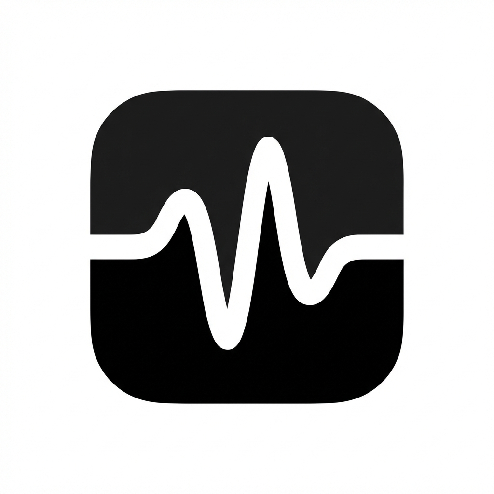

# Flow State 🌊

**Flow State** is a high-performance, local-first AI dictation assistant for macOS. Built with `WhisperKit`, it runs entirely on-device (Apple Silicon optimized), ensuring 100% privacy and zero latency.



## 🚀 Features

-   **Supercharged Dictation:** Uses state-of-the-art models like `Distil-Large-v3` and `Large-v3-Turbo` for unmatched accuracy.
-   **Local & Private:** No cloud APIs. Your voice never leaves your Mac.
-   **Smart Metrics:** Tracks your "Time Saved" compared to typing manually (Calculates WPM vs. Speaking duration).
-   **Instant Paste:** Transcribed text is automatically pasted into your active application.
-   **Global Hotkey:** Trigger dictation from anywhere with a simple shortcut.

## 📦 Installation

1.  Download the latest release (`.dmg`).
2.  Open **FlowState_Installer.dmg**.
3.  Drag the **Flow State** app into the **Applications** folder.
4.  Launch the app!

> **Note:** On first launch, the AI model (approx 1.5GB) will download automatically. This only happens once.

## 🛠️ Building from Source

Requirements:
-   macOS 14.0+ (Sonoma)
-   Xcode 15+
-   Swift 5.9+

### 1. Clone the repository
```bash
git clone https://github.com/yourusername/flow-state.git
cd flow-state
```

### 2. Build the App Bundle
We have a unified build script that handles compilation, signing, and packaging.

```bash
./create_app_bundle.sh
```
This will generate `FlowState.app` in the root directory.

### 3. Create Installer (DMG)
To create the polished distribution DMG (with custom background and icon):

```bash
./create_dmg.sh
```
This will generate `FlowState_Installer.dmg`.

## 🧠 Tech Stack

-   **SwiftUI**: Modern, responsive macOS UI.
-   **WhisperKit**: Argmax's optimized implementation of OpenAI's Whisper for Apple Silicon (CoreML).
-   **AppKit**: Low-level macOS integration (Hotkeys, Window Management).

## 📄 License

MIT License. See [LICENSE](LICENSE) for details.
